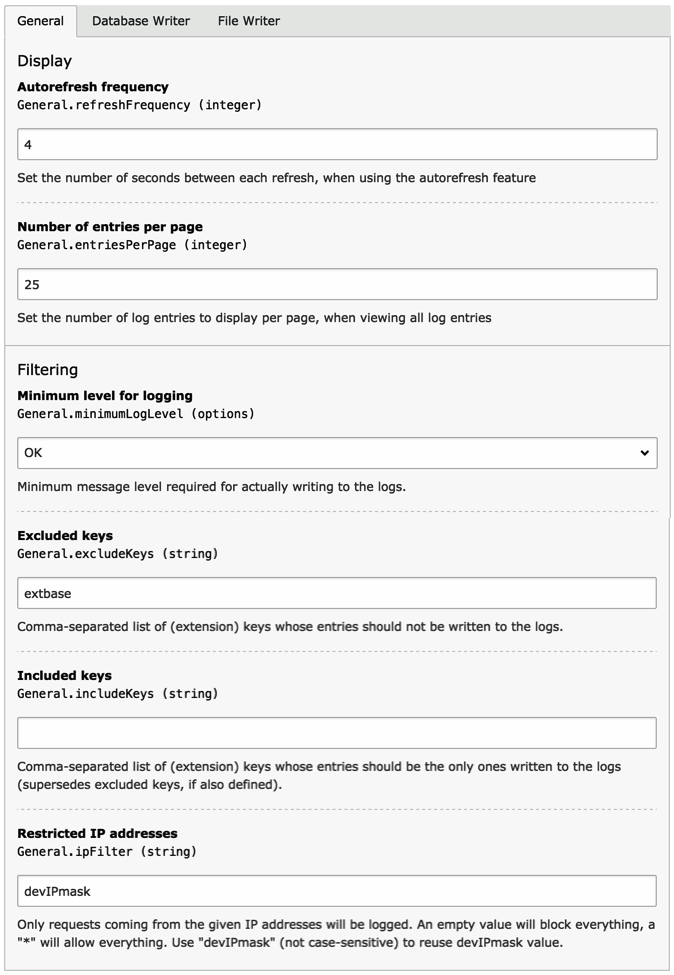
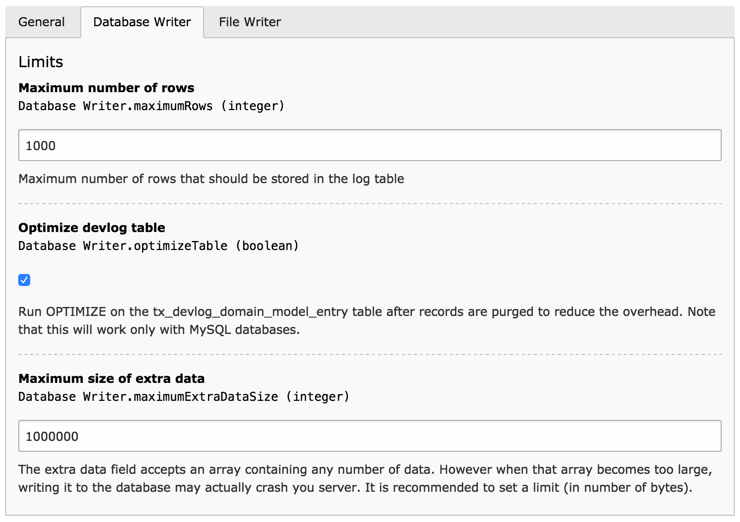
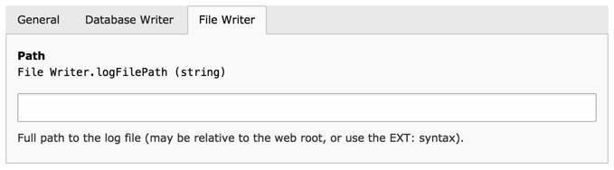

.. ==================================================
.. FOR YOUR INFORMATION
.. --------------------------------------------------
.. -*- coding: utf-8 -*- with BOM.

.. include:: ../Includes.txt

.. _installation:

Installation
------------

Just install the extension via the Extension Manager or via Composer
and you're done. There's nothing more to do, except tuning the
configuration to your taste. The configuration is divided in three
sections, detailed below.

.. important::

   With TYPO3 v8, you need to set :php:`$GLOBALS['TYPO3_CONF_VARS']['SYS']['enable_DLOG'] = true;`
   to activate the Developer's Log. Otherwise no entries will be written at all.

.. _installation-configuration-general:

General configuration
^^^^^^^^^^^^^^^^^^^^^

	Generation Configuration screen in the Extension Manager

Autorefresh frequency
  The backend module can refresh itself automatically, loading all
  new entries that were logged since last module load. The frequency
  is given in seconds.

Number of entries per page
  Number of entries displayed at one time in the backend module.

Minimum level for logging
  Log entries come with a severity that can have the following values: -1 for ok,
  0 for an information, 1 for a notice, 2 for a warning and 3 for an error.
  With this setting you can define from which level you want to start logging entries.
  All entries with a severity below that setting will be ignored.

Excluded keys
  Every log entry (normally) comes with a key. This is generally an extension key or a class name.
  This parameter allows you to define a (comma-separated) list of keys that you don't want to log.
  This will help keep your log table smaller.

  Leave this property empty to log entries whatever their key.

Included keys
  While "Excluded keys" is a black list, "Included keys" is a white list. As soon as
  you define a (comma-separated) list of keys to include, **only** those entries
  that match these keys will be logged. All others are ignored.

  Leave this property empty to log entries whatever their key.

  The "Included keys" property supersedes "Excluded keys".

Restricted IP addresses
  With this setting you can restrict logging to activate only when some
  IP addresses are matched. This property takes a comma-separated list
  of IP addresses. It can also take the special value :code:`devIPmask`
  in which case it will reuse the value from :code:`[SYS][devIPmask]`.

  Set this property to :code:`*` to log entries whatever the incoming IP address.
  On the contrary, set it to an empty value to block everything.

.. _installation-configuration-database-writer:

Database Writer configuration
^^^^^^^^^^^^^^^^^^^^^^^^^^^^^

	Database Writer Configuration screen in the Extension Manager

Maximum number of rows
  This parameter sets an absolute limit on the number of log entries that are stored in the database.
  When that limit is reached, about 10% of the oldest entries are deleted to make room for new ones.
  If you don't want any limit, set this parameter to zero.

Optimize devlog table
  The database table may see a lot of operations, both inserts and deletes.
  After a time some overhead accumulates. By selecting this option,
  an optimization is run every time entries are deleted, as per the “maximum number of rows” option above.

  .. note::

     This operation uses the “OPTIMIZE” SQL statement which is proprietary of MySQL and and is not compatible with DBAL.
     If you use another database than MySQL you should not activate this option.

Maximum size of extra data
  Data of any kind can be passed along to the "devLog" call. The Database Writer serializes it before storage.
  This so-called “extra data” can become quite large in some situations which could bog down the database server.
  To prevent this from happening, this setting will limit the size of the extra data (once serialized).
  The default value is 1 million (characters). Any data above this limit will be stripped and replaced
  by an informational message.

.. tip::

   Another way to keep the database table under control is to use the
   Scheduler's Table garbage collection task to remove all records
   beyond a certain age.

.. _installation-configuration-file-writer:

File Writer configuration
^^^^^^^^^^^^^^^^^^^^^^^^^

	File Writer Configuration screen in the Extension Manager

Path
  The path to the file where the log entries should be written. If left empty,
  the File Writer is disabled.
