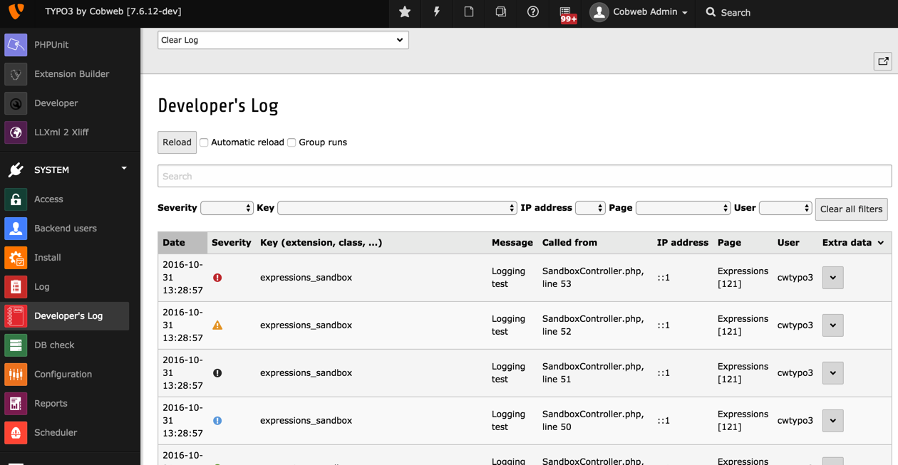

.. ==================================================
.. FOR YOUR INFORMATION
.. --------------------------------------------------
.. -*- coding: utf-8 -*- with BOM.

.. include:: ../Includes.txt

.. _introduction:

Introduction
------------

TYPO3 CMS provides a functionality for logging information for
the purposes of development and debugging via static method
:code:`\TYPO3\CMS\Core\Utility\GeneralUtility::devLog()`.
However this method does not do anything by itself. It simply
provides a hook for registering whatever logging method you wish.
The Developer's Log provides such a method.

Information can be stored in a database table or written to a file.
Custom Writers can be developed to write to other destinations.
Logs in the database can be browsed using a backend module.
Not all Writers can store all the data provided in the
:code:`\TYPO3\CMS\Core\Utility\GeneralUtility::devLog()` call.
In particular, the File Writer cannot store the extra data.

This extension provides the following features:

- log entries are logged in log sessions – one log session per script run.
  That makes it easy to separate log runs.

- frontend logging includes the page id.

- backend module can be opened in a separate window and set to refresh automatically.

- many options for searching and filtering in the backend module

- clear up logs selectively

	The backend module provided by the extension

.. _credits:

Credits
^^^^^^^

This extension was orignally developed by René Fritz and improved and
enhanced by Francois Suter.

Version 3.0 is a complete rewrite.

.. _suport:

Questions and support
^^^^^^^^^^^^^^^^^^^^^

If you have any questions about this extension, please ask them in the
TYPO3 English mailing list, so that others can benefit from the
answers. Please use the bug tracker on forge.typo3.org to report
problem or suggest features
(http://forge.typo3.org/projects/extension-devlog/issues).

.. _happy-developer:

Keeping the developer happy
^^^^^^^^^^^^^^^^^^^^^^^^^^^

Every encouragement keeps the developer ticking, so don't hesitate
to send thanks or share your enthusiasm about the extension.

If you appreciate this work and want to show some support, please
check http://www.monpetitcoin.com/en/francois/support-me/.

.. _participate:

Participating
^^^^^^^^^^^^^

This tool should really be a community tool and as such contributions
are very welcome. The code repository will be moved to GitHub in the
near future. This will helpfully encourage contributions.
