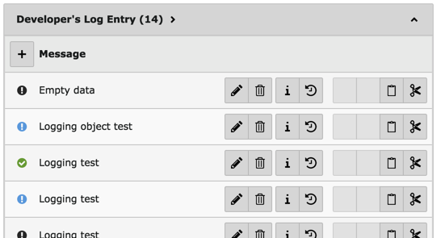
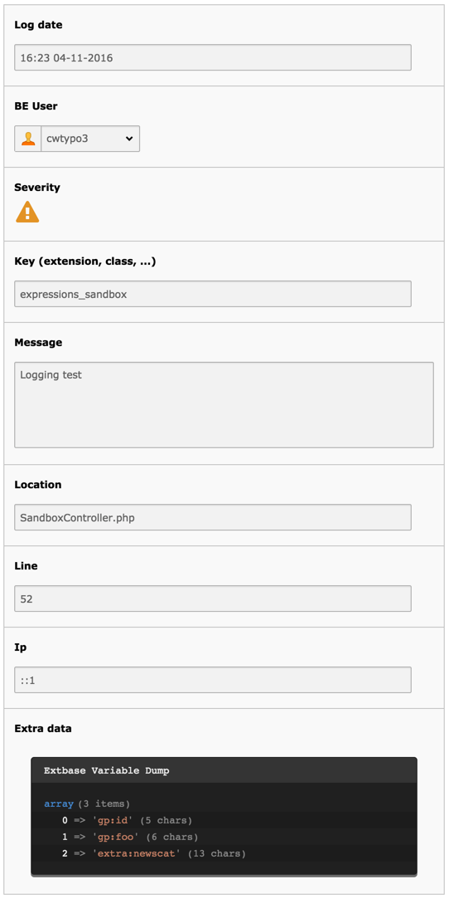
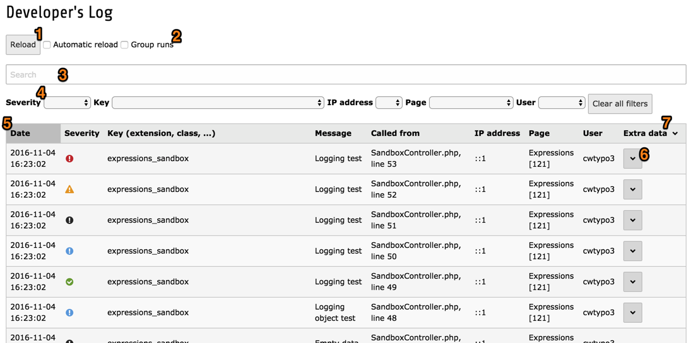
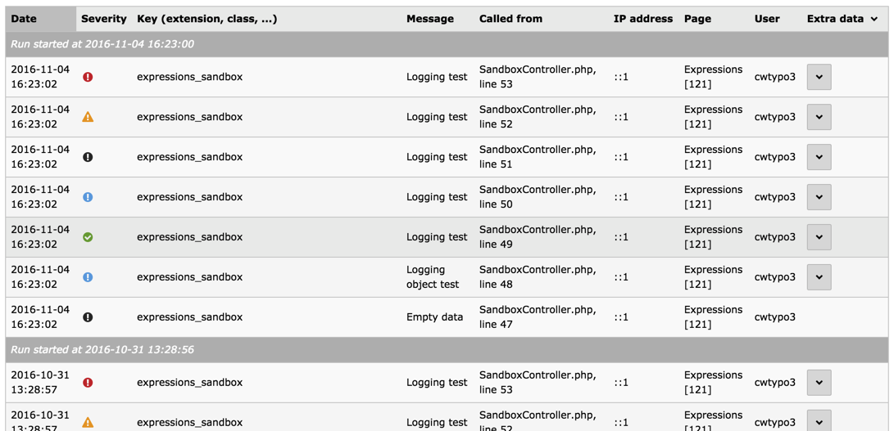
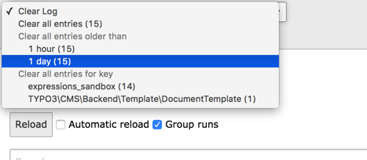

.. ==================================================
.. FOR YOUR INFORMATION
.. --------------------------------------------------
.. -*- coding: utf-8 -*- with BOM.

.. include:: ../Includes.txt

.. _user:

User manual
-----------

Viewing log entries depends on the Writer that was used to store
them. While the File Writer provides a quick text-based access,
the Database Writer makes it possible to have a full backend module,
complete with search and filtering.

.. _user-log-files:

Log files
^^^^^^^^^

This is as straightforward as it gets. Open the log file and you should
see something like:

.. code-block:: text

	2016-11-04T16:23:02+01:00 [NOTICE] Empty data (SandboxController.php 47)
	2016-11-04T16:23:02+01:00 [INFO] Logging object test (SandboxController.php 48)
	2016-11-04T16:23:02+01:00 [OK] Logging test (SandboxController.php 49)
	2016-11-04T16:23:02+01:00 [INFO] Logging test (SandboxController.php 50)
	2016-11-04T16:23:02+01:00 [NOTICE] Logging test (SandboxController.php 51)
	2016-11-04T16:23:02+01:00 [WARNING] Logging test (SandboxController.php 52)
	2016-11-04T16:23:02+01:00 [ERROR] Logging test (SandboxController.php 53)

.. _user-single-entry:

Viewing a single entry
^^^^^^^^^^^^^^^^^^^^^^

The Database Write writes log entries in the page where the call happened or
at the root of the TYPO3 CMS installation if the call didn't happen within the
context of a page. Those records can be seen in the **WEB > List** module.
Records are ordered with the most recent on top.

	List of log entries in the WEB > List module

To view the details of a single entry, click on the "Edit" icon.

	Viewing the details of a log entry (all fields are read-only)

.. _user-backend-module:

The backend module
^^^^^^^^^^^^^^^^^^

The backend module can be used to view all entries written to the database
no matter on which page they are stored. Furthermore it provides a number
of search, filtering and ordering features.

	The Developer's Log backend module with features highlighted

Hitting the "Reload" button **(1)** will load all log entries that were
written since you started viewing the backend module. The table is refreshed.
Checking the "Automatic reload" checkbox will trigger the reload
action at predefined intervals (as per the
:ref:`extension configuration <installation-configuration-general>`).

The "Group runs" option **(2)** changes the table display to visually
separate log entries that belong to the same "run", i.e. the same
execution of a request to TYPO3 CMS.

	The list of log entries grouped by runs

The search bar **(3)** is a simple keyword search, but it acts on all columns,
including the extra data. The various filters **(4)** each correspond to
a given column and will filter data accordingly. All filters can be reset
by clicking on the "Clear all filtes" button.

Data can be sorted by clicking on any column header **(5)**. The extra data
is collapsed by default and can be viewed by clicking on any downward-pointing
arrow **(6)**. Clicking on the arrow in the header cell **(7)** expands extra
data for all rows.

.. _user-backend-module-clear-entries:

Clearing log entries
""""""""""""""""""""

In the docheader stands a menu for clearing log entries. From there,
you can choose to delete all entries or delete them for a given
period of time or for a given key.

	The menu for clearing log entries

